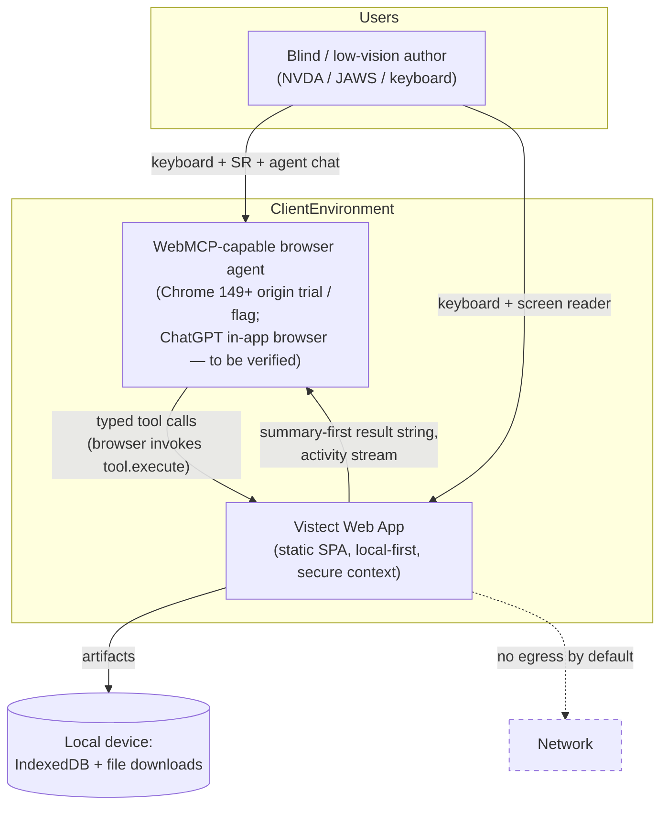
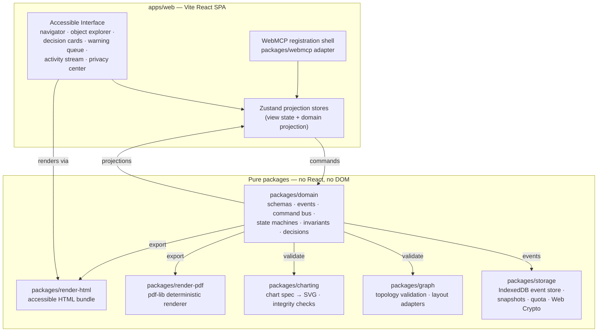
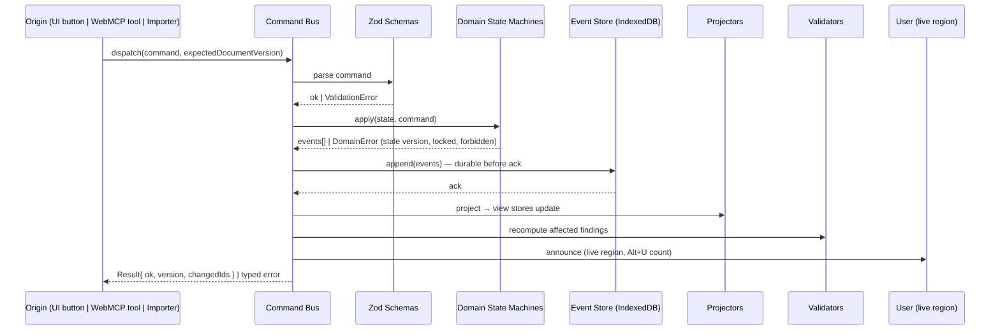
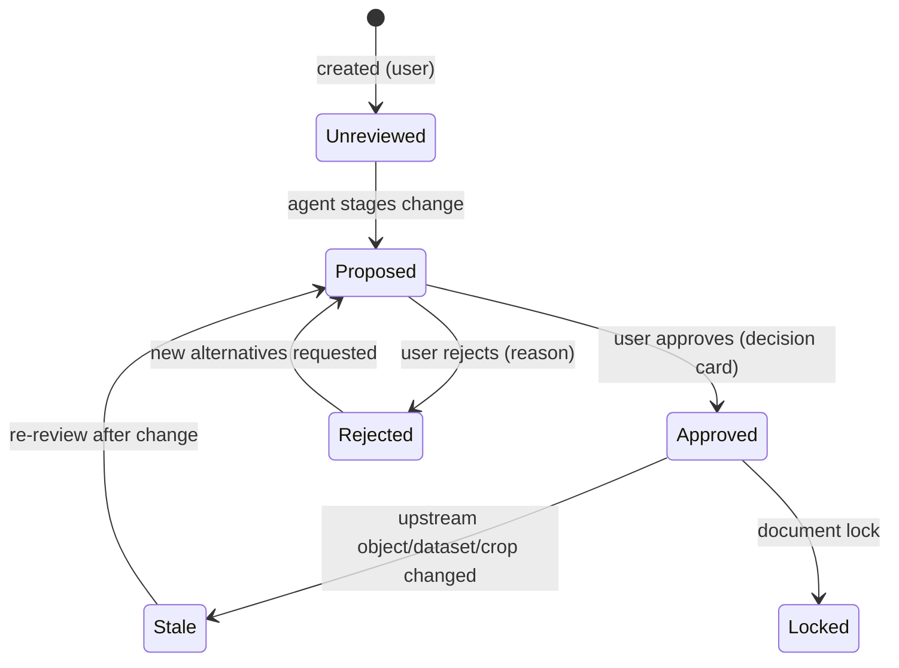
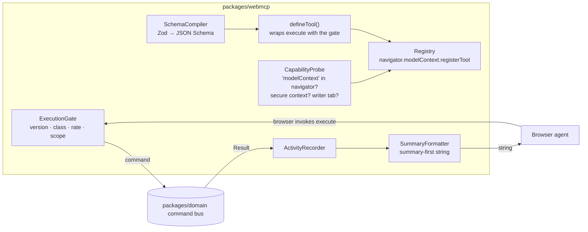

# 03 — Architecture

> Engineering execution plan Phase 3 (Architecture Review). Decisions are binding; deviations require an ADR amendment.

## 1. System Context (C4 Level 1)

**Key property:** the application itself makes **zero network calls containing document content**. The only interpretive "AI" in the system is the user's own agent, chosen and trusted by the user. R2 extension point: a pluggable remote-provider adapter behind the same consent pipeline (ADR-001).

## 2. Component Diagram (C4 Level 2 — containers inside the SPA)

## 3. Service Boundaries & Bounded Contexts

| Bounded context | Package | Owns | Speaks |
|---|---|---|---|
| **Document** | `packages/domain` | Project, pages, objects, reading order, versions, approvals, lifecycle | Commands + Events |
| **Decision Ledger** | `packages/domain` (submodule) | Visual decisions, alternatives, approvals, staleness | Events (subscribes to object/page changes) |
| **Validation** | `packages/domain` + `graph` + `charting` | Findings, deterministic checks, severity, recompute triggers | Event reactions |
| **Assets** | `apps/web` (asset service) + `storage` | Uploads, sanitization, metadata, provenance, crops | Commands to Document context |
| **Graph** | `packages/graph` | Diagram topology math, layout | Pure functions over diagram data |
| **Charting** | `packages/charting` | Chart spec, rendering geometry, integrity math | Pure functions |
| **Rendering/Export** | `render-html`, `render-pdf` | HTML preview, PDF, bundles, hashes | Pure project-state → bytes |
| **Agent Integration** | `packages/webmcp` | Tool registry, schema compilation, gates, activity stream | Command bus + registry adapter |
| **Privacy** | `apps/web` privacy center + `storage` receipts | Consent, receipts, redaction | Events |

**Context mapping:** all contexts integrate through the **command bus and event log** inside the Document context (shared kernel = domain schemas). Engines (graph/charting/render) are pure libraries called by validators and exporters — no context may call another context's internals directly.

## 4. Event Flow (single write path — the core invariant)

**Why:** one choke point makes audit (§9), stale-version rejection (FR-122), approval invalidation (FR-013), and undo (event logic) provable instead of aspirational. UI and agent are peers — the agent gets no privileged path.

## 5. Data Flow (authoring loop)

1. User/agent issues semantic command (e.g., `place_object_relative_to`).
2. Domain computes **relative constraints** → layout engine resolves **bounds** (template grid + constraints → geometry).
3. Same resolved geometry feeds: on-screen preview (HTML/SVG), deterministic validators (overlap/overflow/contrast), and exporters (HTML/PDF). **One layout engine, three consumers** — this is what makes "export the exact version you inspected" true (ADR-003).
4. Findings recompute incrementally per affected scope (object/page/document).
5. Decisions stage; approval flips state; lock freezes; export hashes.

## 6. Storage Architecture

| Store | Contents | Notes |
|---|---|---|
| IndexedDB `vistect-events` | Append-only event log per project | System of record; durable write before UI ack |
| IndexedDB `vistect-snapshots` | Materialized project state at version N | Compaction: keep snapshot + tail; rebuild by replay |
| IndexedDB `vistect-assets` | Image blobs (Blob handles), sanitized SVG text | Deduplicated by content hash |
| IndexedDB `vistect-meta` | Project index, actor identity, settings, privacy receipts, log ring buffer | Never contains document prose |
| OPFS (fallback) | Large asset overflow | If quota pressure detected |

- **Multi-tab safety:** `BroadcastChannel` + storage lock; single-writer tab election; other tabs read-only with "another tab is editing" banner (NFR-008).
- **Encryption (FR-007):** optional passphrase → PBKDF2 → AES-GCM project package export/import via Web Crypto.
- **Quota:** `navigator.storage.estimate()` monitoring; user-visible storage status; `persist()` request; never silent eviction.

## 7. Permission Model

- **Local actor model:** a local pseudonymous actor id (generated UUID, label "You") fills `approvedBy`; agents are actors of kind `browser_agent` with the agent's reported origin where available. No accounts, no network identity (gap G1 closed by design).
- **Operation classes (ADR-008 §2.3):** `read` (31 tools, free, `readOnlyHint`) · `write` (19, command bus, version-gated) · `consequential` (17, stages a `VisualDecision` requiring later human approval) · `human_gated` (5, completes only inside `client.requestUserInteraction`, where the user's gesture mints the approval token).
- **WebMCP permissions:** tools registered on `navigator.modelContext`; `exposedTo` left at default (own origin + built-in agents), no cross-origin exposure in R1 (FR-166); `Permissions-Policy` value for WebMCP to be confirmed against the current spec before Phase 9 (tracked in ADR-008 §4 A11 / release checklist) rather than assumed.
- **Agent action authority:** an agent can *propose* anything, *execute* nothing finalizing without a user gesture, and *never* self-approve. Enforced structurally: finalizing tools obtain their token from inside `requestUserInteraction`, and the approve/reject commands are not exposed as tools at all (FR-163). Command-bus guards remain as the second line, not the only one.

## 8. Versioning Architecture

- Version = monotonic integer = number of committed event batches on the project.
- Every write command carries `expectedDocumentVersion`; mismatch → typed `StaleVersionError` with current version returned (agent can re-read and retry).
- Objects carry `versionCreated` / `versionModified`; approvals carry `approvedVersion`; staleness = `approvedVersion < currentVersionOf(target)`.
- Snapshots at configurable interval (default every 50 versions or on lock/export); event tail retained for undo depth (default 100 commands).
- Exports hash: `SHA-256(canonical serialized project state @ version V)` recorded in manifest and stamped into PDF metadata + HTML bundle.

## 9. Audit Architecture

- **Agent activity stream:** append-only log of every tool execution: tool name, inputs (redacted for sensitive assets), result status, version before/after, timestamp, actor. Rendered as accessible chronological list; exportable as JSON.
- **Decision ledger:** see domain model; every consequential change links `decisionId` ↔ events ↔ affected object ids.
- **Privacy receipts:** per FR-142, immutable entries.
- Local-only (NFR-010); excluded from any analytics by construction.

## 10. Approval Workflow Architecture

- Decision cards render options, evidence, uncertainty, rejected alternatives with reasons.
- Approval authority is human-only (guard in command bus: `actor.kind !== "human" → ApprovalDenied`).
- `Alt+U` global queue; live-region counts.

## 11. Accessibility Architecture

- **Semantic HTML-first component system**: native elements before ARIA; ARIA only where native is insufficient (live regions, composite navigation) — see `08-accessibility-review.md`.
- **Announcement bus** in the UI shell: command-bus events → human sentences → `aria-live="polite"` region; assertive only for blocking failures.
- **Focus discipline**: every modal/dialog restores focus to invoker; agent actions never steal focus (spec §21.3); roving tabindex for object explorer.
- **Rendering is dual-purpose**: the same preview that a sighted reviewer (or the agent's vision) consumes is exposed to screen readers through the semantic explorer — visuals are never the only representation.
- CI: axe-core on every story/E2E route + keyboard-travel tests + zoom/reflow spot checks.

## 12. WebMCP Architecture (ADR-008)

> **ADR-008 is the authoritative contract** and supersedes spec §19 on the registration namespace and the `execute` return shape, and supersedes the §18.2–18.11 tool enumeration. Registration is on **`navigator.modelContext`**. Everything in this section is testable against ADR-008 §4's dated assumption list.

**Namespace.** `navigator.modelContext`. Nothing outside `packages/webmcp` may reference it (lint-enforced, NFR-017). The prior `document.modelContext` reading would have made the capability probe permanently falsy: no tool would register, degradation would engage on every load, and the mock harness — mocking the same wrong object — would have stayed green.

**Registry.** Exactly **72 tools** in 10 groups (canonical list: ADR-008 §2.3). Operation classes: 31 read, 19 write, 17 consequential, 5 human-gated.

**Gate placement.** The agent's invocations reach each tool's own `execute` directly; `executeTool` is a page-side dry-run/diagnostics entry point only. A gate at the registry boundary would therefore be bypassed by every real agent call while still appearing to work in dry-runs. The gate is applied at **tool-definition time**: `defineTool()` returns an already-wrapped `execute`, and no `registerTool` call site may pass a raw function (FR-162).

**Schemas.** Every tool input is a Zod schema in `packages/domain/toolSchemas`; `zod-to-json-schema` emits `additionalProperties:false` JSON Schema at build time — single source of truth (ADR-004). Loose enough to read; the real checking happens inside `execute` with errors that say what to do next.

**Annotations (FR-129).** `readOnlyHint: true` on all 31 read tools — exactly the read class, verified in both directions. `untrustedContentHint: true` on the 28 read tools that surface text from imports, uploads, or user authoring, so the agent treats that text as data rather than instructions. This is the platform's own contribution to the T-02 / SEC-02 defence and sits alongside (not instead of) static descriptions, results-as-data, and the injection corpus.

**Titles.** Every tool sets `title`. Without it the activity stream announces `place_object_relative_to` verbatim to a screen reader; with it, "Place an object relative to another".

**Results.** `execute` returns a **string**, which the browser wraps — not an MCP `{content:[…]}` envelope, which is the server wire format. The string is summary-first (FR-160): one plain-language sentence naming what changed, the new document version, and the unapproved-decision count, then the structured payload. One string serves both the agent's comprehension and the FR-152 announcement. Read results always carry `currentDocumentVersion` (FR-161), so the agent has a legitimate source for `expectedDocumentVersion`.

**Human authority — two tiers, deliberately distinct.**
- *Consequential* (17): the tool applies the change as `proposed`, opens a `VisualDecision` with alternatives and evidence, announces, and enqueues for `Alt+U`. Review happens later in a real decision card. This is stronger than a modal confirmation and is the product's differentiator (PR-03).
- *Human-gated* (5): `execute` awaits `client.requestUserInteraction(callback)`; the user's gesture inside the callback mints the approval token and supplies the `human` actor, so I-03 and I-11 hold by construction rather than by a rejecting guard.

`approve_visual_decision` / `reject_visual_decision` are **not registered** — an agent-invocable approval either always fails (misleading tool design) or lets the agent decide (violates product principle 1). `open_decision_for_review` replaces them and reports the user's own choice (FR-163).

**Injection defense:** tool descriptions are static string constants from code; tool results are data (never evaluated); document text renders as text nodes only; see `07-security-review.md`.

**Registration lifecycle.**
1. Probe on app start → typed `CapabilityReport` with reason (`ok` · `no_api` · `insecure_context` · `read_only_tab`), surfaced to the user (FR-164). WebMCP requires a secure context (NFR-016).
2. Register when a project context opens, scoped to one `AbortController` per project session.
3. Read-only secondary tabs register **read tools only** (FR-165); writes there return guidance to switch tabs.
4. `controller.abort()` on project close, route change, or loss of writer status.
5. `ontoolchange` is an **outbound** notification that the tool set changed — it is not a trigger for the page to re-register. Lifetime is governed solely by our own controllers.

**Degradation:** without WebMCP the app is fully usable via keyboard/UI; agent-only affordances hide with an explanatory note naming the probe reason (FR-127, FR-164). WebMCP is the extra lane for agents, never the only lane.

**Declarative API:** evaluated and rejected for R1 (ADR-008 §2.10) — core operations are not form-shaped, and annotating the three form-shaped surfaces would create a second write path around the command bus. `toolautosubmit` is never used (FR-167).

- **Spec version pin:** `WEB_MCP_SPEC_VERSION = "chrome-149-origin-trial-2026-05"` constant in `packages/webmcp/src/version.ts`; CI fails if registered tool shapes drift from this spec version.

## 13. Design Decisions & Tradeoffs (summary; full reasoning in ADRs)

| Decision | Chosen | Rejected | Rationale |
|---|---|---|---|
| AI analysis | Agent-as-analyst (no provider) | Built-in LLM API | User's insight: WebMCP agent *is* the LLM. Zero keys/cost/egress; more spec-faithful (§35). Tradeoff: analysis quality varies by agent; mitigated by forced structured schemas + deterministic local extractors. R2 adapter for offline/multi-model. |
| App shape | Static SPA (Vite) | Next.js SSR | Local-first IndexedDB app; SSR adds nothing; simpler WebMCP lifecycle. Tradeoff: no server features ever needed anyway. |
| PDF export | pdf-lib from layout engine | Puppeteer server / print CSS | Deterministic, offline, hash-bindable. Tradeoff: we own text layout; acceptable for 10 fixed templates (bounded problem). |
| State | Event-sourced core + Zustand view | Redux / XState | Version/approval/undo semantics fall out of events naturally. Tradeoff: more up-front machinery. |
| Charts | Custom SVG renderer | Vega-Lite | Integrity checks need exact geometry; 3 chart types is a small surface. Tradeoff: more chart types later = more work; revisit at R2. |
| Diagram layout | ELK.js lazy-loaded, dagre fallback | Pure CSS / manual | Best-in-class layered layout; deterministic seeds. Tradeoff: bundle weight — lazy chunk. |
| Schemas | Zod everywhere, compiled to JSON Schema | Hand-written JSON Schema | No drift between tool contract and runtime validation. |

## 14. Future Scaling Paths

1. **R2 remote-analysis adapter** behind the §22.2 consent pipeline (BYOK keys, local k-vault) — no architectural change; the consent/receipt pipeline already models it.
2. **Sync/multi-device:** event log is sync-friendly (CRDT not needed if single-writer; export/import packages bridge devices first).
3. **Collaboration (R2 comments, R3 review links):** event-sourced core extends to per-actor streams; decision ledger already models human vs agent actors.
4. **Team libraries / enterprise policy (R4):** asset context and validation rules are already package boundaries; policy = pluggable validator registry.
5. **More document types:** document type is a discriminated field; templates/validators are data-driven registries.
