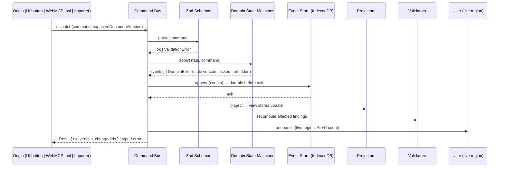
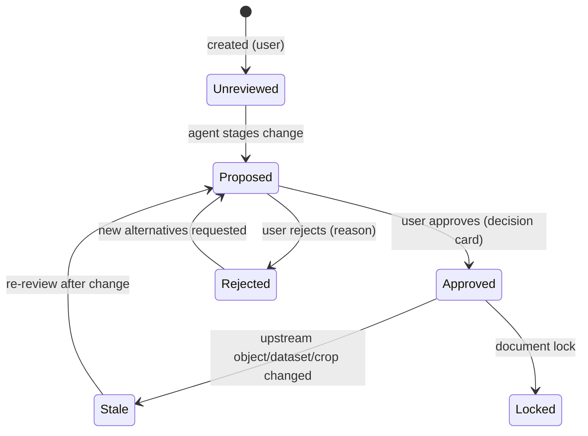
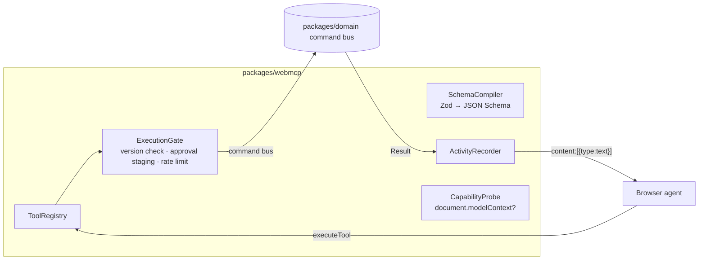

# 03 — Architecture

> Engineering execution plan Phase 3 (Architecture Review). Decisions are binding; deviations require an ADR amendment.

## 1. System Context (C4 Level 1)

```mermaid
graph TB
    subgraph Users
        BV[Blind / low-vision author\n(NVDA / JAWS / keyboard)]
    end
    subgraph ClientEnvironment
        AG[WebMCP-capable browser agent\n(ChatGPT in-app browser,\nChrome 149+ with flag)]
        WEB[Vistect Web App\n(static SPA, local-first)]
        AG -- "typed tool calls\n(modelContext.executeTool)" --> WEB
        WEB -- "structured results,\nactivity stream" --> AG
    end
    BV -- "keyboard + SR + agent chat" --> AG
    BV -- "keyboard + screen reader" --> WEB
    WEB -- "artifacts" --> FS[(Local device:\nIndexedDB + file downloads)]
    WEB -.-> |"no egress by default"| NET[Network]
    style NET stroke-dasharray: 5 5
```

**Key property:** the application itself makes **zero network calls containing document content**. The only interpretive "AI" in the system is the user's own agent, chosen and trusted by the user. R2 extension point: a pluggable remote-provider adapter behind the same consent pipeline (ADR-001).

## 2. Component Diagram (C4 Level 2 — containers inside the SPA)

```mermaid
graph TB
    subgraph appsweb[apps/web — Vite React SPA]
        UI[Accessible Interface\nnavigator · object explorer ·\ndecision cards · warning queue ·\nactivity stream · privacy center]
        ST[Zustand projection stores\n(view state + domain projection)]
        WM[WebMCP registration shell\npackages/webmcp adapter]
    end
    subgraph domainlayer[Pure packages — no React, no DOM]
        DOM2[packages/domain\nschemas · events · command bus ·\nstate machines · invariants · decisions]
        GRP[packages/graph\ntopology validation · layout adapters]
        CHT[packages/charting\nchart spec → SVG · integrity checks]
        RPDF[packages/render-pdf\npdf-lib deterministic renderer]
        RHTML[packages/render-html\naccessible HTML bundle]
        STOR[packages/storage\nIndexedDB event store ·\nsnapshots · quota · Web Crypto]
    end
    UI --> ST
    WM --> ST
    ST -- commands --> DOM2
    DOM2 -- events --> STOR
    DOM2 -- projections --> ST
    DOM2 -- validate --> GRP
    DOM2 -- validate --> CHT
    DOM2 -- export --> RPDF
    DOM2 -- export --> RHTML
    UI -- renders via --> RHTML
```

## 3. Service Boundaries & Bounded Contexts

| Bounded context | Package | Owns | Speaks |
|---|---|---|---|
| **Document** | `packages/domain` | Project, pages, objects, reading order, versions, approvals, lifecycle | Commands + Events |
| **Decision Ledger** | `packages/domain` (submodule) | Visual decisions, alternatives, approvals, staleness | Events (subscribes to object/page changes) |
| **Validation** | `packages/domain` + `graph` + `charting` | Findings, deterministic checks, severity, recompute triggers | Event reactions |
| **Assets** | `apps/web` (asset service) + `storage` | Uploads, sanitization, metadata, provenance, crops | Commands to Document context |
| **Graph** | `packages/graph` | Diagram topology math, layout | Pure functions over diagram data |
| **Charting** | `packages/charting` | Chart spec, rendering geometry, integrity math | Pure functions |
| **Rendering/Export** | `render-html`, `render-pdf` | HTML preview, PDF, bundles, hashes | Pure project-state → bytes |
| **Agent Integration** | `packages/webmcp` | Tool registry, schema compilation, gates, activity stream | Command bus + registry adapter |
| **Privacy** | `apps/web` privacy center + `storage` receipts | Consent, receipts, redaction | Events |

**Context mapping:** all contexts integrate through the **command bus and event log** inside the Document context (shared kernel = domain schemas). Engines (graph/charting/render) are pure libraries called by validators and exporters — no context may call another context's internals directly.

## 4. Event Flow (single write path — the core invariant)



**Why:** one choke point makes audit (§9), stale-version rejection (FR-122), approval invalidation (FR-013), and undo (event logic) provable instead of aspirational. UI and agent are peers — the agent gets no privileged path.

## 5. Data Flow (authoring loop)

1. User/agent issues semantic command (e.g., `place_image_relative_to`).
2. Domain computes **relative constraints** → layout engine resolves **bounds** (template grid + constraints → geometry).
3. Same resolved geometry feeds: on-screen preview (HTML/SVG), deterministic validators (overlap/overflow/contrast), and exporters (HTML/PDF). **One layout engine, three consumers** — this is what makes "export the exact version you inspected" true (ADR-003).
4. Findings recompute incrementally per affected scope (object/page/document).
5. Decisions stage; approval flips state; lock freezes; export hashes.

## 6. Storage Architecture

| Store | Contents | Notes |
|---|---|---|
| IndexedDB `vistect-events` | Append-only event log per project | System of record; durable write before UI ack |
| IndexedDB `vistect-snapshots` | Materialized project state at version N | Compaction: keep snapshot + tail; rebuild by replay |
| IndexedDB `vistect-assets` | Image blobs (Blob handles), sanitized SVG text | Deduplicated by content hash |
| IndexedDB `vistect-meta` | Project index, actor identity, settings, privacy receipts, log ring buffer | Never contains document prose |
| OPFS (fallback) | Large asset overflow | If quota pressure detected |

- **Multi-tab safety:** `BroadcastChannel` + storage lock; single-writer tab election; other tabs read-only with "another tab is editing" banner (NFR-008).
- **Encryption (FR-007):** optional passphrase → PBKDF2 → AES-GCM project package export/import via Web Crypto.
- **Quota:** `navigator.storage.estimate()` monitoring; user-visible storage status; `persist()` request; never silent eviction.

## 7. Permission Model

- **Local actor model:** a local pseudonymous actor id (generated UUID, label "You") fills `approvedBy`; agents are actors of kind `browser_agent` with the agent's reported origin where available. No accounts, no network identity (gap G1 closed by design).
- **Operation classes:** `read` (free), `write` (command bus, version-gated), `consequential` (stages a decision — requires human approval before effects become approved state), `finalizing` (export — requires approval token issued by explicit user gesture).
- **WebMCP permissions:** tools registered on `document.modelContext`; default visibility (own origin + built-in agents); no cross-origin `exposedTo` in R1; `Permissions-Policy: tools=(self)` on hosting headers.
- **Agent action authority:** an agent can *propose* anything, *execute* nothing finalizing, and *never* self-approve. Enforced in command bus guards, not in UI.

## 8. Versioning Architecture

- Version = monotonic integer = number of committed event batches on the project.
- Every write command carries `expectedDocumentVersion`; mismatch → typed `StaleVersionError` with current version returned (agent can re-read and retry).
- Objects carry `versionCreated` / `versionModified`; approvals carry `approvedVersion`; staleness = `approvedVersion < currentVersionOf(target)`.
- Snapshots at configurable interval (default every 50 versions or on lock/export); event tail retained for undo depth (default 100 commands).
- Exports hash: `SHA-256(canonical serialized project state @ version V)` recorded in manifest and stamped into PDF metadata + HTML bundle.

## 9. Audit Architecture

- **Agent activity stream:** append-only log of every tool execution: tool name, inputs (redacted for sensitive assets), result status, version before/after, timestamp, actor. Rendered as accessible chronological list; exportable as JSON.
- **Decision ledger:** see domain model; every consequential change links `decisionId` ↔ events ↔ affected object ids.
- **Privacy receipts:** per FR-142, immutable entries.
- Local-only (NFR-010); excluded from any analytics by construction.

## 10. Approval Workflow Architecture



- Decision cards render options, evidence, uncertainty, rejected alternatives with reasons.
- Approval authority is human-only (guard in command bus: `actor.kind !== "human" → ApprovalDenied`).
- `Alt+U` global queue; live-region counts.

## 11. Accessibility Architecture

- **Semantic HTML-first component system**: native elements before ARIA; ARIA only where native is insufficient (live regions, composite navigation) — see `08-accessibility-review.md`.
- **Announcement bus** in the UI shell: command-bus events → human sentences → `aria-live="polite"` region; assertive only for blocking failures.
- **Focus discipline**: every modal/dialog restores focus to invoker; agent actions never steal focus (spec §21.3); roving tabindex for object explorer.
- **Rendering is dual-purpose**: the same preview that a sighted reviewer (or the agent's vision) consumes is exposed to screen readers through the semantic explorer — visuals are never the only representation.
- CI: axe-core on every story/E2E route + keyboard-travel tests + zoom/reflow spot checks.

## 12. WebMCP Architecture (ADR-008)



- **Registration lifecycle:** probe on app start; register tools when a project context opens; `AbortController` unregister on project close/route change; re-register on `toolchange`-capable browsers.
- **Schemas:** every tool input is a Zod schema in `packages/domain/toolSchemas`; `zod-to-json-schema` emits `additionalProperties:false` JSON Schema at build time — single source of truth (ADR-004).
- **Results:** MCP content format `{content:[{type:"text",text:JSON.stringify(structured)}]}`; minimal necessary fields; never HTML; never instructions.
- **Injection defense:** tool descriptions are static strings from code; tool results are data (never evaluated); document text is rendered as text nodes only; see `07-security-review.md`.
- **Degradation:** without `document.modelContext`, the app is fully usable via keyboard/UI; agent-only affordances hide with an explanatory note (FR-127).

## 13. Design Decisions & Tradeoffs (summary; full reasoning in ADRs)

| Decision | Chosen | Rejected | Rationale |
|---|---|---|---|
| AI analysis | Agent-as-analyst (no provider) | Built-in LLM API | User's insight: WebMCP agent *is* the LLM. Zero keys/cost/egress; more spec-faithful (§35). Tradeoff: analysis quality varies by agent; mitigated by forced structured schemas + deterministic local extractors. R2 adapter for offline/multi-model. |
| App shape | Static SPA (Vite) | Next.js SSR | Local-first IndexedDB app; SSR adds nothing; simpler WebMCP lifecycle. Tradeoff: no server features ever needed anyway. |
| PDF export | pdf-lib from layout engine | Puppeteer server / print CSS | Deterministic, offline, hash-bindable. Tradeoff: we own text layout; acceptable for 10 fixed templates (bounded problem). |
| State | Event-sourced core + Zustand view | Redux / XState | Version/approval/undo semantics fall out of events naturally. Tradeoff: more up-front machinery. |
| Charts | Custom SVG renderer | Vega-Lite | Integrity checks need exact geometry; 3 chart types is a small surface. Tradeoff: more chart types later = more work; revisit at R2. |
| Diagram layout | ELK.js lazy-loaded, dagre fallback | Pure CSS / manual | Best-in-class layered layout; deterministic seeds. Tradeoff: bundle weight — lazy chunk. |
| Schemas | Zod everywhere, compiled to JSON Schema | Hand-written JSON Schema | No drift between tool contract and runtime validation. |

## 14. Future Scaling Paths

1. **R2 remote-analysis adapter** behind the §22.2 consent pipeline (BYOK keys, local k-vault) — no architectural change; the consent/receipt pipeline already models it.
2. **Sync/multi-device:** event log is sync-friendly (CRDT not needed if single-writer; export/import packages bridge devices first).
3. **Collaboration (R2 comments, R3 review links):** event-sourced core extends to per-actor streams; decision ledger already models human vs agent actors.
4. **Team libraries / enterprise policy (R4):** asset context and validation rules are already package boundaries; policy = pluggable validator registry.
5. **More document types:** document type is a discriminated field; templates/validators are data-driven registries.
